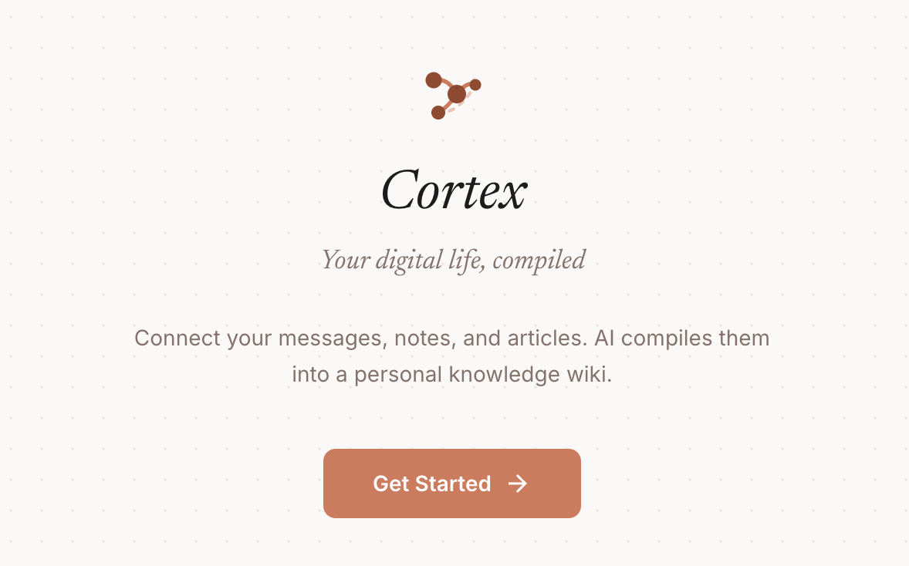
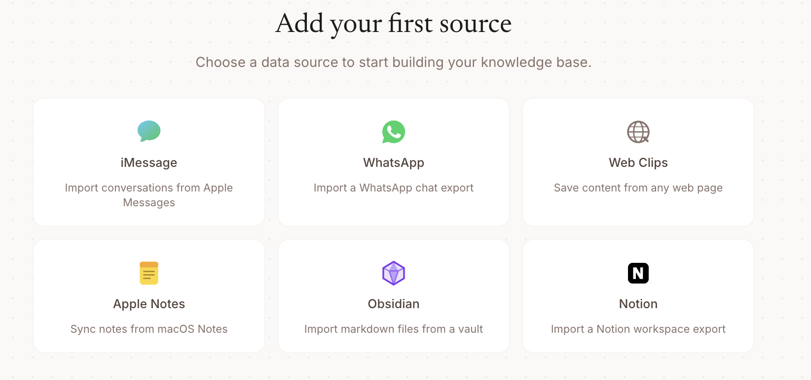
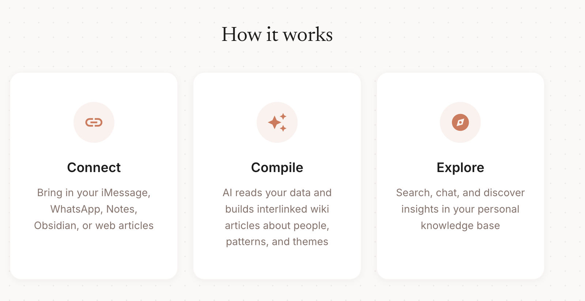
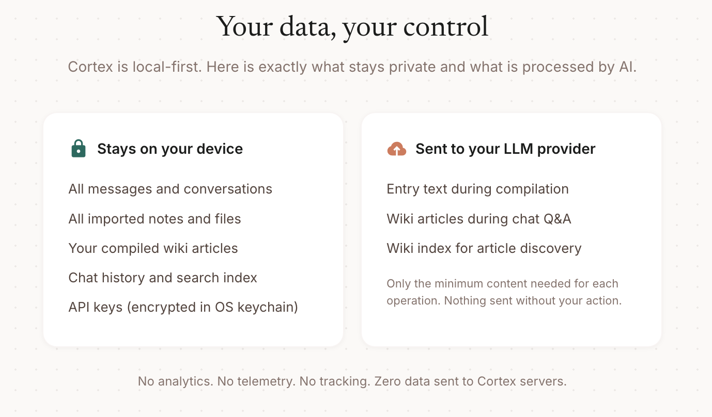

<div align="center">

# Cortex

Your digital life, compiled.

</div>

---

Cortex is a desktop app that turns your personal data into a knowledge base. You connect your messages, notes, and bookmarks. An AI reads everything, finds the patterns, and writes a structured wiki about your life.

You never write the wiki. The AI does. You explore it.

Built on ideas from [Andrej Karpathy's LLM Knowledge Bases](https://gist.github.com/karpathy/442a6bf555914893e9891c11519de94f) and [Farza's wiki skill](https://gist.github.com/farzaa/c35ac0cfbeb957788650e36aabea836d).



## Get started

```bash
git clone https://github.com/tamimsangrar/cortex.git
cd cortex
npm install
npm run dev
```

Requires Node.js 18+ and an API key from [Anthropic](https://console.anthropic.com/) or [OpenAI](https://platform.openai.com/). The app walks you through setup on first launch.



To build a production `.dmg`:

```bash
npm run build
```

## How it works

You import data from any of the supported connectors. Each conversation, note, or article becomes a raw entry stored as a markdown file on your machine.



When you hit Compile, the AI processes your entries in batches. A fast, cheap model reads the entries and decides what wiki articles to create or update. Then a full model writes the actual content. Articles are organized by theme (people, patterns, decisions, places), not by date.

The compiler skips trivial entries automatically, groups related entries together for better context, and runs quality checks every 15 entries. When a topic outgrows its article, it gets split into its own page.

Once your wiki is built, you can browse articles in a file tree, visualize connections in a knowledge graph, or search everything with Cmd+K. The chat lets you ask questions and the AI reads your wiki to answer. You can also expose your wiki to external AI agents through the built-in MCP server.



## Supported connectors

| Source | Platform | How it works |
|--------|----------|-------------|
| iMessage | macOS only | Reads directly from your local Messages database |
| WhatsApp | All platforms | Import a chat export (.zip or .txt) |
| Apple Notes | macOS only | Pulls notes via AppleScript |
| Obsidian | All platforms | Point to any vault folder |
| Notion | All platforms | Import a Notion export (.zip) |
| Web Clips | All platforms | Paste any URL to save as markdown |

## MCP server

Cortex includes a built-in MCP server so any LLM agent can read and search your wiki. Connect it to Claude, Copilot, or any MCP-compatible client.

```bash
claude mcp add cortex -- npx tsx mcp/server.ts
```

Eight tools available: `search_wiki`, `read_article`, `list_articles`, `read_index`, `list_sources`, `read_source`, `search_sources`, `get_wiki_stats`.

There is also an HTTP server for remote access:

```bash
npx tsx mcp/http-server.ts
```

## Data privacy


All data is stored locally in `~/BrainDump/`. Nothing leaves your machine except during AI calls to the provider you chose (Anthropic or OpenAI). API keys are encrypted through your operating system's keychain. There is no analytics, no telemetry, and no tracking of any kind.

## License

MIT
